# 计算理论

Owner: 浥青城

# 考试范围

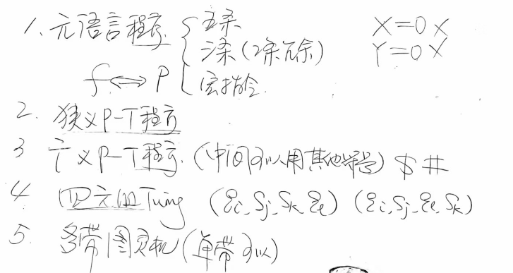

# 真题整理

## 考前笔记

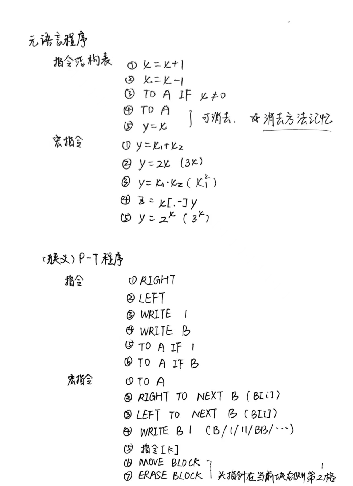

## 元语言程序

2018A：

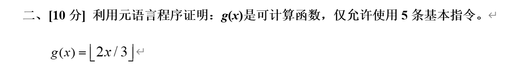

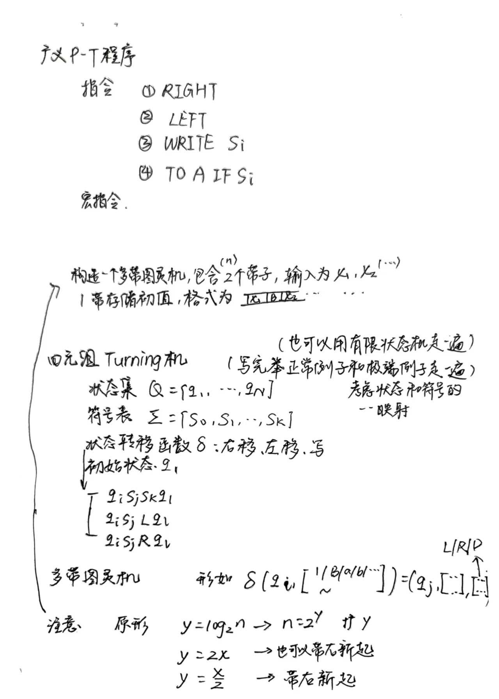

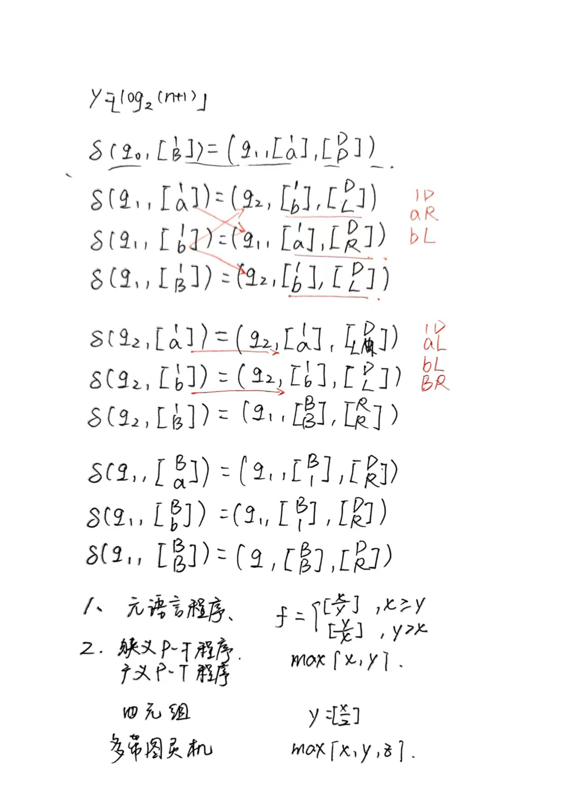

2020B：

2019B：

## 狭义P-T程序

暂无

## 广义P-T程序

2018B：

2019B：

## 四元组Turing

2018B：

2020B：

2018A：

## 多带图灵机

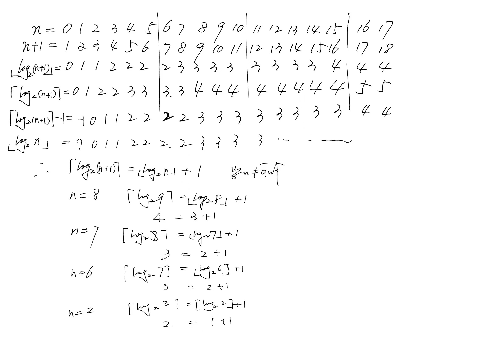

下面这题很精妙，其实还是之前的扩充y的思路，一直扩充，比如n=3的情况，带二先从ab开始试，试到aab成功，然后把a、b都刷成1进入接受状态就行。

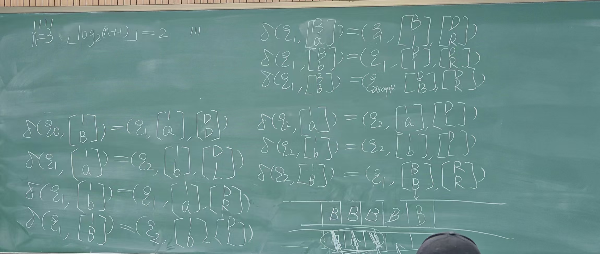

2018A：

# 可计算函数（元语言程序）

## 程序设计语言

我们首先引进一个 FORTRAN 式的极简单的程序设计语言。语言包括赋值语句，条件
转移和无条件转移语句。语句可带标号也可不带标号。

用带或不带下标的小写字母表示变元。例如：
$x，y，z，x1，…，z1，z2，…$等等。

假定这些变元取非负整数值，在讲义中凡是提到**数就指非负整数**。
标号一般地用下列大写字母表示：
$A，B，C，D，E，…，A_1，A_2，B_1，B_2 ，…$等等。

虽然我们的语言是极为简单的，但我们将看到它足以描述任何复杂的计算过程，而且指
令表中的后二条也是可节省的。于是从理论上说只要三条指令就可以了。

### **指令结构表（五条）**

程序中变元按其作用可分为三类：

- 一是在执行程序前必须通过外部的方法给值的变元，这种变元称为程序的输入变元或自由变元
- 一是表示计算结果的变元，称这种变元为程序的输出变元，因函数值是一个整数，因此一个程序过程只有一个输出变元；
- 一是用于存放临时值的变元，称这种变元为程序的临时变元或工作变元。

在本书中约定：

1. **用 x 表示输入变元**。例如：
x0，x1，x2，x3，……
2. **用 z 表示临时变元**。例如：
z0，z1，z2，z3，……
3. **用 y 表示输出变元。**

另外，对程序特做如下的规定：

1. 当程序开始执行时自动认为一切变元(输入变元除外)的值为 0。
2. 当程序出现下列两种情况之一时自动认为停机：
    1. 转向无定义的标号。
    2. 执行了程序的最后一条指令，但没有下一条指令。

### 宏指令

$y=x1+x2$

$y=2x$

习题中出现的宏定义补充：

$y=x_1•x_2$

$z=x[.-]y$

证明过程见习题T2

## 无条件转移和赋值的消去

我们将说明下面两种指令是可消去的：

$TO  A$
$y=x$

### **无条件转移**

### **赋值的消去**

## 例题

利用原语言程序，证明函数是可计算的

### T1：$y=\alpha(x[.-]3)$

### T2：$z=x[.-]y$

记得判断x1非0的极端情况

### T3：$y=[2x/3]$

不拆$z=z-1$应该也是可以的

### T4和5：$y=max(x1,x2),y=min(x1,x2)$

欣赏简洁的解法

### T6：$y=sqrt(x)$

其实就是不断扩大x直到撑破条件，需要注意的是新的宏定义

类似的解法给出到下面：

### T7：$y=log(x)$

# Post-Turing程序（狭义）

## Post-Turing程序定义

## Post-Turing程序：数据

## Post-Turing程序：初始状态

## Post-Turing程序：目标状态

## Post-Turing程序：指令

## 宏指令列表

| **宏指令** | **含义** |
| --- | --- |
| TO A | 指令无条件转移 |
| RIGHT TO NEXT B | 头指针右移到下一个B |
| LEFT TO NEXT B | 头指针左移到下一个B |
| WRITE B1 | 写B和1，头指针右移2格 |
| 指令[k] | 指令重复执行k次 |
| MOVE BLOCK | 将当前块整体右移1格，头指针指向当前块右侧的第1格 |
| ERASE BLOCK | 将当前块整体删除，头指针指向当前块右侧的第2格 |

两个BLOCK操作需要单独注意一下：

## 用P-T指令模拟程序P

### BEGIN

### 模拟指令

### 自增

### 自减

### 条件转移

### END

## 例题

### T1：计算P(x)=x[.-]1的P-T程序

### T2：分段函数的P-T程序

### T3：y=2x

其余解法：

### T4：y=[x/3]

### T5：y=[x/2]

# 广义Post-Turing程序

## 广义Post-Turing程序：数据

## 广义Post-Turing程序：指令

## 例题

### T1：y=2x

### T2：y=[x/3]

### T3：y=[2x/3]

# 四元组Turning机

## 例题

### T1：S(x)=x+1 的Turing机

（两种都可以，感觉第一种更好一些）

### T2：S(x)=2x 的Turing机

### T3：S(x)=[x/2] 的Turing机

# 多带图灵机

这块PPT说的比较少，其实和四元图灵机差不多，注意的是D操作是停留，不L也不R。并且状态向量的元素个数代表了带数，最后结果在任意一条带上都行。

## 例题

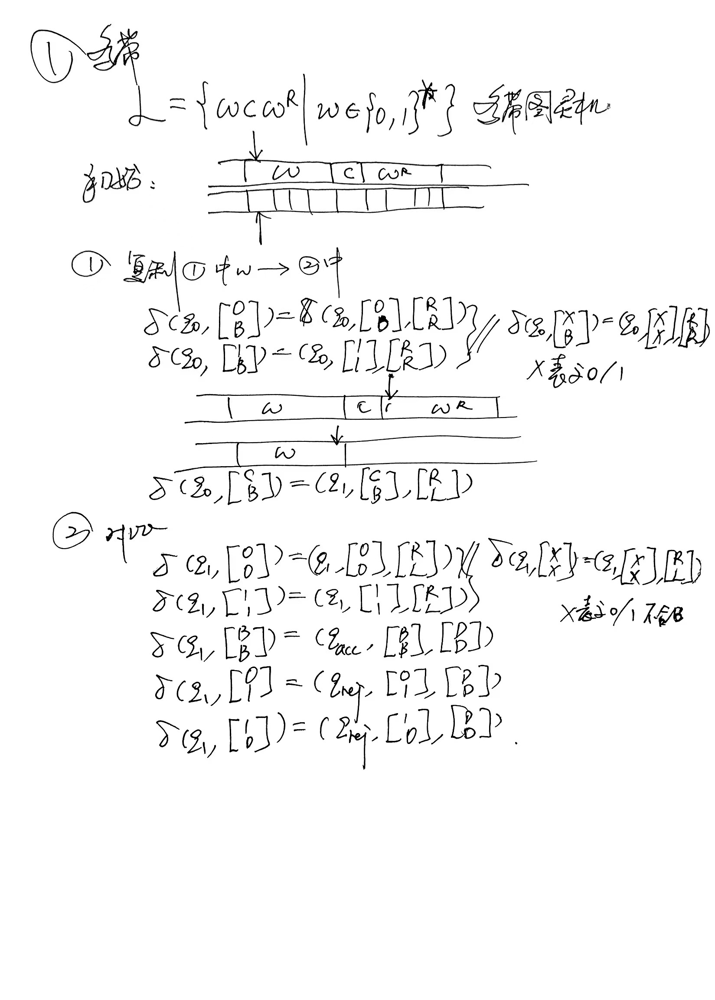

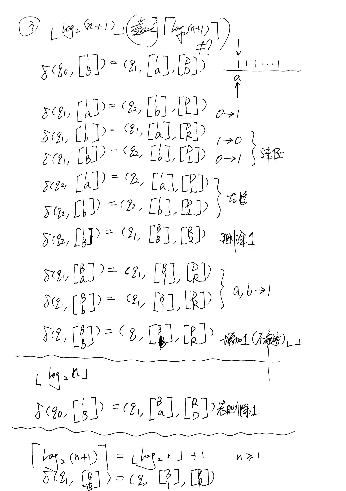

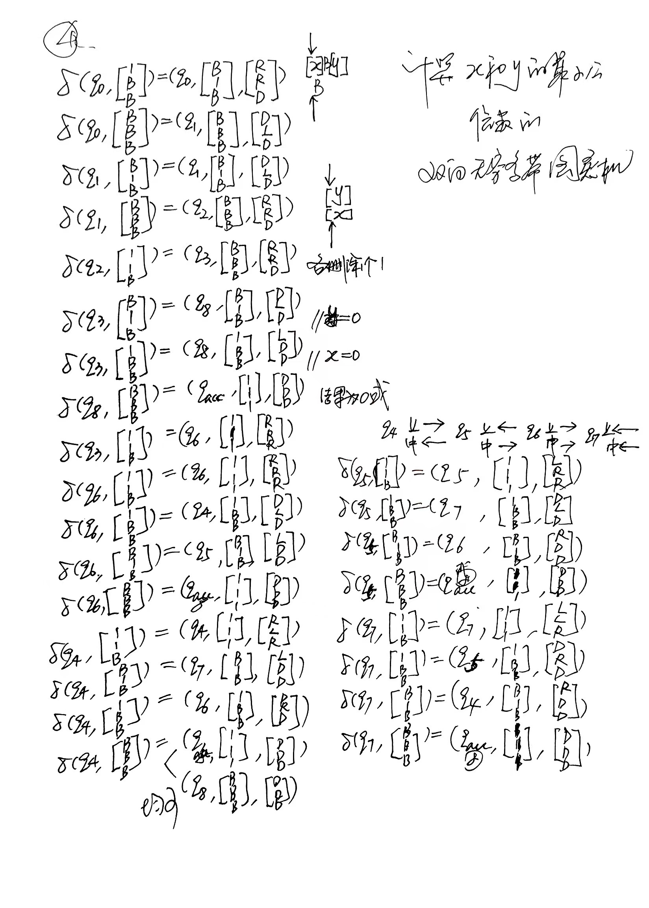

参考资料：

吕帅老师PPT、手写笔记、真题

多带图灵机：

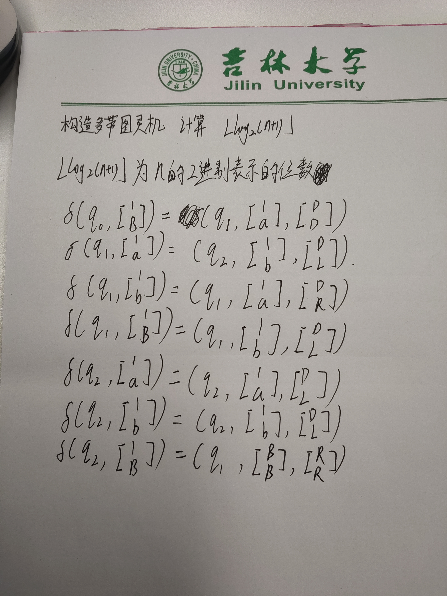

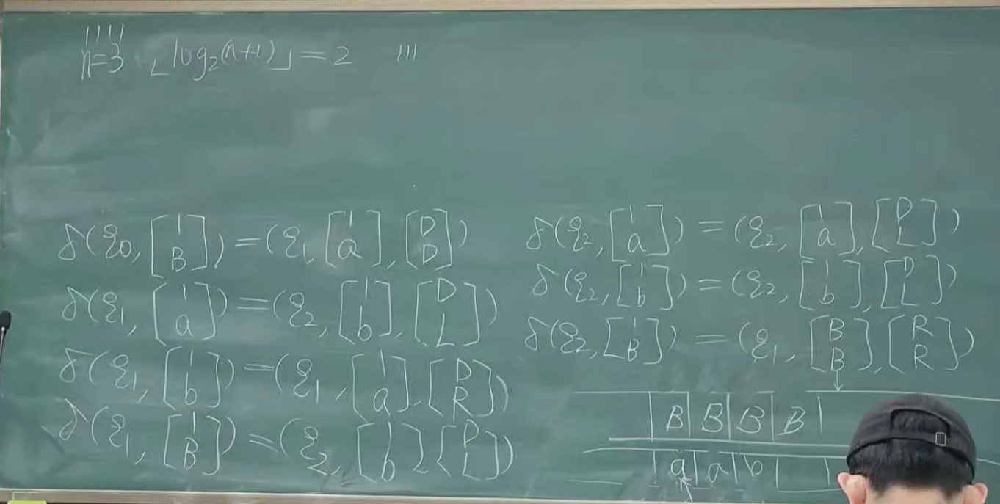

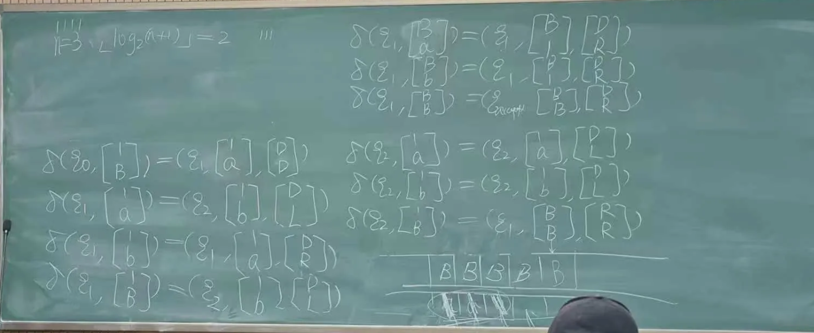

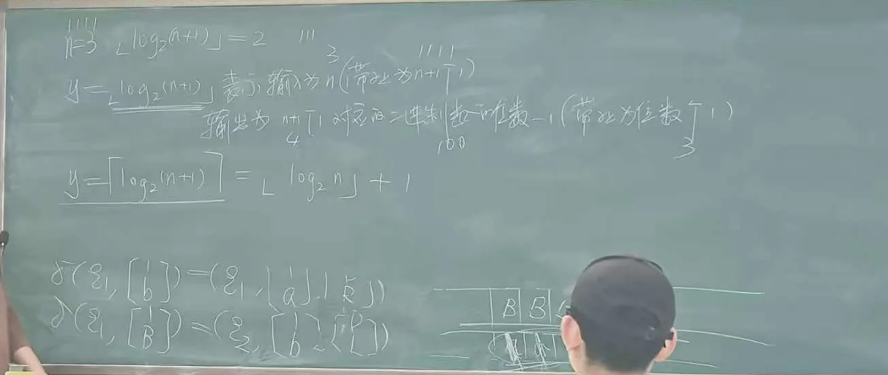

Post-Turing程序：指令

